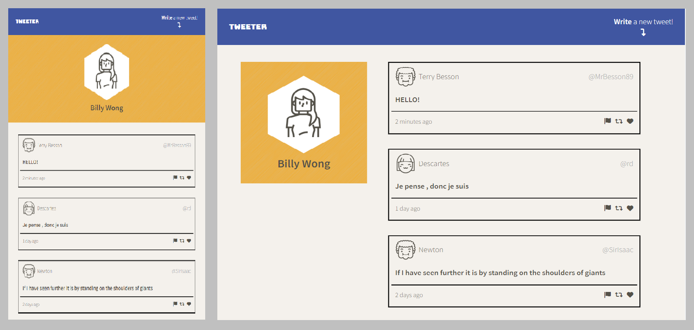
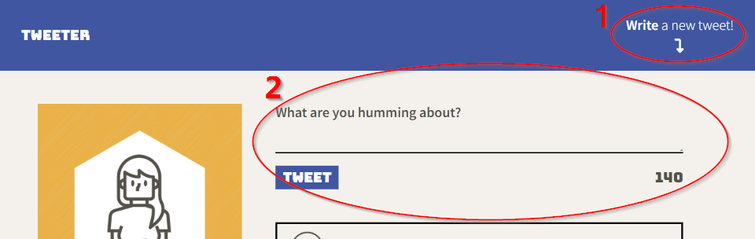

# Tweeter Project

Tweeter is a single-page Twitter clone project that dynamically renders new tweets submitted by users.

* Front-End : HTML, CSS (SCSS), JS, jQuery, Ajax
* Back-End  : NodeJS, Express, in-memory database

## Final Product

## Features
* Animated and toggleable tweet form
* Auto resize navigation bar to provide maximum visuality
* Real-time form validation to ensure valid input
* Dynamic rendering
  * Ajax submit and fetch data without reloading the page
* Responsive design for desktop and mobile devices

## Getting Started
1. clone this repo `git@github.com:bwong-yh/tweeter.git`
2. nagivate to tweeter dir
3. enter `npm install` to install necessary modules

## How to Use
1. start web server with `npm run local` command
2. open browser and enter `localhost:8080` in the address bar
3. open tweet form by clicking on <strong>Write a new tweet</strong> on the top right of the page

4. tweet away~!

## Dependencies

* body-parser
* chance
* Express
* Node 5.10.x or above
* timeago
